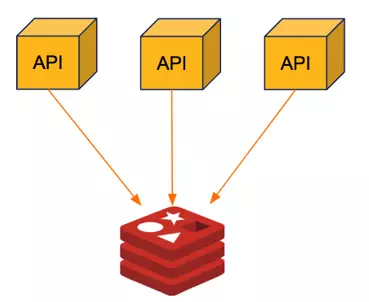
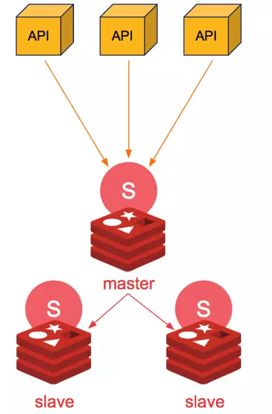
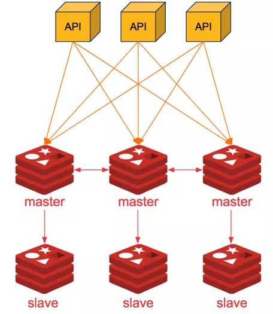

# Các command cơ bản trong Redis
## **String**
- CMD
  - GET key 
  - SET key value 
  - EXISTS key


## **Hash**
  - one key - many value
  - CMD:
    - HSET name key value
    -  HGET name key
    - HMSET name key1 vakue1 key2 value2
    - HMGET name key1 key2
    - HDEL name key
    - HLEN name
    - HEXISTS name key
    - HINCRBY name key number
    - HKEYS name
    - HVALS name
    - HGETALL name
  - Using: Cart


## **List**
- CMD:
    - **LPUSH** name key1 key2 key3 ...  left push
    - **LRANGE** name start stop  like slice js
    - **RPUSH** ...
    - **LPOP** name stop  delete number_ele first left
    - **RPOP** ...
    - **BLOP** name timeout
    - **LINDEX** name index
    - **LLEN** name
    - **LREM** name index1 index2
    - **LTRIM** name start stop
    - **LSET** name index new_value
    - **LINSERT** name BEFORE|AFTER ele value
- Using: queue, stack,.. MQ: đảm bảo thứ tự, duplicate,

## **Sets**

- lưu không trùng lặp giá trị, không theo thứ tự cố định
- CMD:
  - **SADD** name val1 val2 val3 ...
  - **SMEMBERS** name  show
  - **SREM** name val  remove val
  - **SCARD** name  length
  - **SISMEMBER** name val  check exists
  - **SRANDMEMBER** name count
  - **SPOP** name count
  - **SMOVE** src des val
  - **SINTER** key1 key2
- Using: like post, suggestion, tìm bạn, sản phẩm chung


## **Zset**
- Tập hợp có thứ tự
- cmd:
  - **ZADD** name val1 key1 ...
  - **ZREVRANGE** name start stop WITHSCORES  sort by value
  - **ZRANGE** name start stop
  - **ZREM** name key
  - **ZINCRBY** name val key
  - **ZRANGEBYSCORE** name prev after
- Using: bảng xếp hạng ...


## **Transaction**

* **Watch**: Đặt các key cần theo dõi.
* **Multi**: Bắt đầu một transaction.
```yaml
redis> MULTI
OK
redis> SET key1 "value1"
QUEUED
redis> INCR key2
QUEUED
redis> EXEC
1) OK
2) (integer) 2
```
* **Exec**: Thực thi transaction. Nếu có bất kỳ key nào bị thay đổi, EXEC sẽ trả về nil.
* **Discard**: Hủy bỏ transaction.


## Redis – 3 vấn đề LỚN khi sử dụng cache

1. Sự cố tuyết lở trong Cache (cache avalanche)

* Đặt thời gian hết hạn đồng đều
* Khóa Mutex
* Chiến lược cache kép
* Cập nhật bộ nhớ cache trong background.
* 

2. Sự cố sụp đổ (cache breakdown)

* Nếu exp time => set cache without expire time
* set lại exp cache => cronjob at 00:00
* Mutex => req1 -> lock, req2 ...
*


3. Sự cố xâm nhập cache (cache penetration)

* Nếu record không tồn tại trong dbs => set value null -> redis
* Validate query => disable req or set value null
* 

## Triển khai khoá phân tán (Optimistic và Pessimistic)

* **Optimistic**: dùng cho trường hợp các request đến hầu hết sẽ update resource
* **Pessimistic**: dùng cho trường hợp các request đến có cả Update lẫn Get dữ liệu và chủ yếu là Get
* Optimisic lock sẽ block để compare version, nếu X lock trước Y, nhưng Y lại xử lý xong trước -> X update fail -> X retry

=> Optimistic lock: áp dụng khi có xác suất conflict transaction thấp, -> giảm retry. 

=> Pessimistic lock: áp dụng khi có xác suất conflict transaction cao để đảm bảo data consistence.


## **Bảo mật cho redis**
1. Thay đổi Port
```shell
[root@master-node ~]# /etc/init.d/redis_6379 stop
[root@master-node ~]# cat /opt/redis/conf/6379.conf  | grep 'port 6379'
port 6379
[root@master-node ~]# cat /etc/init.d/redis_6379 | grep REDISPORT
REDISPORT="6379"

# VD ta đổi thành port 6800, cần đổi ở trong file config và file khởi động.
[root@master-node ~]# vi /opt/redis/conf/6379.conf 
port 6800
[root@master-node ~]# vi /etc/init.d/redis_6379
REDISPORT="6800"

#Kiểm tra:
[root@master-node ~]# ps aux | grep redis | grep server
root      97040  0.1  0.1 165072  3032 ?        Ssl  13:09   0:00 /usr/local/bin/redis-server 127.0.0.1:6800
[root@master-node ~]# redis-cli -h 127.0.0.1 -p 6800 INFO
```
2. Chặn firewall
  * Nếu bạn chạy app và redis chung 1 server, giữ nguyên bind 127.0.0.1, Port redis chỉ lắng nghe nội bộ nên khá an toàn.
    Trường hợp App và redis nằm ở riêng 2 server khác nhau, ta để bind 0.0.0.0 nhưng chú ý Chặn Firewall hoặc chặn network ở mạng nội bộ DMZ.
```shell
[root@master-node ~]# cat /opt/redis/conf/6379.conf | grep bind | grep -v '#'
bind 127.0.0.1 -::1
Sửa thành bind 0.0.0.0 . Và chú ý về Firewall, chặn không cho bên ngoài tấn công.
```
3. Đặt mật khẩu cho redis
```shell
[root@master-node conf]# redis-cli -p 6800
127.0.0.1:6800> ACL SETUSER default on >matkhau ~* &* +@all
OK
127.0.0.1:6800> CONFIG REWRITE
OK
[root@master-node conf]# redis-cli --user default --pass matkhau -p 6800 INFO
Ta kiểm tra config sẽ có thêm 1 dòng sau:
[root@master-node conf]# cat /opt/redis/conf/6379.conf | grep 'user default'
user default on #6445e373d7fcde106bfcb897ee8f0bb28589bd7797f54f1ef4e5d5447cfbd011 ~* &* +@all

Sửa lại init file, nếu không sửa bạn sẽ không bật tắt đc redis bằng init/systemd:
[root@master-node conf]# vi /etc/init.d/redis_6379  | grep cli
CLIEXEC="/usr/local/bin/redis-cli --user default --pass matkhau"
```
4. Xóa những lệnh nguy hiểm
```shell
127.0.0.1:6379> ACL CAT dangerous
1) "replconf"
2) "restore"
3) "cluster"
4) "pfdebug"
5) "bgrewriteaof"
6) "latency"
7) "acl"
8) "swapdb"
9) "info"
10) "replicaof"
11) "migrate"
12) "flushall"
13) "flushdb"
14) "lastsave"
15) "keys"
16) "save"
17) "config"
18) "pfselftest"
19) "restore-asking"
20) "slaveof"
21) "sync"
22) "failover"
23) "debug"
24) "slowlog"
25) "role"
26) "module"
27) "psync"
28) "sort"
29) "client"
30) "monitor"
31) "bgsave"
32) "shutdown"
```
5. Không cho redis chạy quyền root.
```shell
[root@master-node ~]# adduser redis --no-create-home
[root@master-node ~]# vi /etc/systemd/system/redis.service
[Unit]
Description=Redis data structure server
Documentation=https://redis.io/documentation
Wants=network-online.target
After=network-online.target

[Service]
ExecStart=/usr/local/bin/redis-server /opt/redis/conf/6379.conf --supervised systemd --daemonize no
ExecStop=/usr/local/bin/redis-cli SHUTDOWN
#ExecStop=/usr/local/bin/redis-cli --user default --pass matkhau SHUTDOWN
LimitNOFILE=10032
User=redis
Group=redis

[Install]
WantedBy=multi-user.target

# Với hệ thống dùng init file ta chạy thẳng start bằng user redis.
[root@master-node ~]# /etc/init.d/redis_6379 stop
[root@master-node ~]# adduser redis --no-create-home
[root@master-node ~]# chown -R redis.root /opt/redis
[root@master-node ~]# chown redis.redis /etc/init.d/redis_6379
[root@master-node ~]# su - redis
-bash-4.2$ /etc/init.d/redis_6379 start
Starting Redis server..
-bash-4.2$ ps aux | grep redis
redis     85679  0.3  0.1 162512  3216 ?        Ssl  08:47   0:00 /usr/local/bin/redis-server 0.0.0.0:6379
```
Ngoài ra , để bảo mật redis còn có các đề nghị sau đây:
- Phân quyền chạy và đọc file tối thiểu (file chạy là 750, file log, config là 640)
- Đặt lịch Backup log, config, dump
- Bật TLS giữa client và redis-server.

## Mô hình Redis Replication/ Cluster / HA
### Mô hình đơn:

```
- Ưu điểm: 
Tiết kiệm chi phí, phù hợp với môi trường nhỏ. Hiệu suất cao

- Nhược điểm: 
Không có tính dự phòng, nếu sập thì phải dựng lại từ đầu (nếu có backup dump.rdb thì thời gian load lại dữ liệu vài phút. VD: HDD, 50tr key tầm 2-5 phút). 
Có thể đưa lên k8s quản lý cho tiện. Nếu data chấp nhận tổn thất và code load lại từ Database thì sẽ gần như zero downtime (2-30s).
```
### Phân biệt giữa Replication và Cluster:
```
Phân biệt:
1) Replication: 1Master-1Slave hoặc 1Master-(N)Slave (mỗi node sẽ chứa đủ 100% dữ liệu). 
2) Sharding cluster: Partition data (data được chia lẻ và lưu trên nhiều node khác nhau, tổng dữ liệu riêng rẽ các node = 100%). 

>> Khi nào ta nên chọn giữa replication / cluster sharding?:
- Về cơ bản, mô hình (1Master)- (1Slave) là đủ hoàn toàn để redis chạy hết hiệu năng cho cả 1 hệ thống lớn hàng trăm nghìn truy vấn trên 1s (bank/viễn thông...). 
- Vấn đề nằm ở chỗ khi lượng Ram cần dùng để lưu trữ Data của redis > vượt quá Ram của Server đang chạy. Khi đó ta sẽ bắt đầu chia nhỏ dữ liệu ra để lưu ở "nhiều server" khác nhau. Khi client gọi vào, redis-cluster sẽ hướng dẫn truy xuất vào chính xác node nào có dữ liệu.
```

### Mô hình 1Master-1Slave hoặc 1Master-(N)Slave:


```
Ưu điểm:
- Mô hình 1Master-1Slave hoặc 1Master-(N)Slave sẽ đảm bảo dữ liệu luôn luôn được dự phòng.
- Khi xảy ra sự cố với node Master, ta sẽ manual Slave node thay làm Master.
- Có thể cho node M làm write, và các node S làm read, tăng khả năng chia tải.

Nhược điểm:
- Khi Master chết, phải cấu hình thủ công Slave lên làm Master. Và phải tự động chuyển luồng cho client gọi vào M mới.
- Tối ưu hơn, ta có thể có mô hình Setinel tự động detect Master down và đẩy Slave node khác lên làm Master ở mục C.
- Vẫn sẽ có độ trễ về đồng bộ thông tin từ M > S. Ví dụ ta HMSET hàng triệu key có độ dài lớn vào M.
```
### Mô hình SETINEL

```
Ưu điểm:
- Mô hình Setinel đã tối ưu ở việc "bầu chọn" đâu sẽ là Master node khi có node bị chết
- Nhưng app không biết đâu là Master mới để gọi vào khi Master bị thay đổi. 
Để khắc phục vấn đề này, các siêu nhân khác đã đưa ra phương án dùng HA-Proxy để phát hiện và lái luồng TCP về redis master. 
Hoặc dùng thư viện client sẵn có (như java jedis) có thể tự detect được đâu là M trong khối Setinel (không cần cài HAProxy)

Nhược điểm:
- Cần nhiều tài nguyên (cần ít nhất là 3 node để tránh bị tình trạng bầu chọn không đồng đều, các slave-setinel tự nhận mình là master - hiện tượng Split-Brain)
```
### Mô hình SHARDING CLUSTER

```
Ưu điểm:
- Khắc phục được yếu điểm các mô hình trên là băm nhỏ dữ liệu sang các node.
- Đảm bảo downtime gần như zero. Dữ liệu luôn được đảm bảo 100% (gồm 3 node chính và 3 node phụ)
- Dễ dàng  mở rộng, chỉ cần gõ lệnh chia dữ liệu sang các node mới

Nhược Điểm:
- Cấu hình phức tạp, cần code client phải hỗ trợ cluster.
- Chỉ chạy trên db0 (không hỗ trợ multi db)
```
